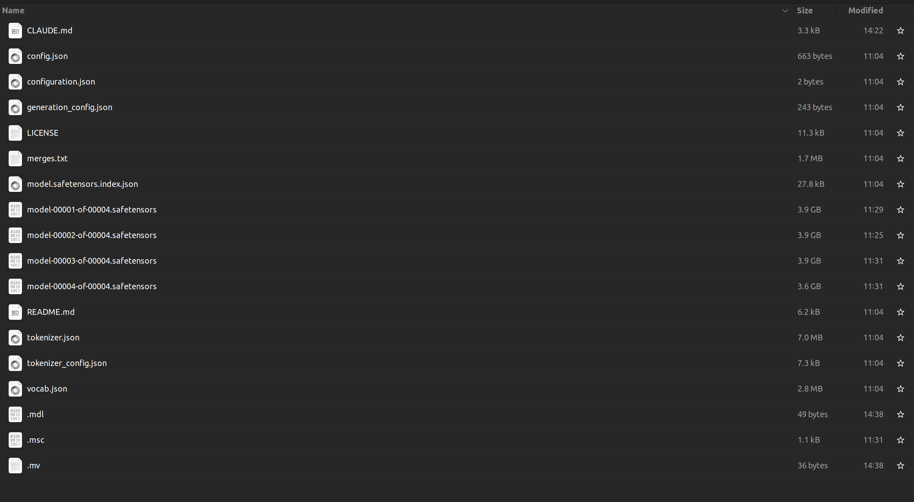
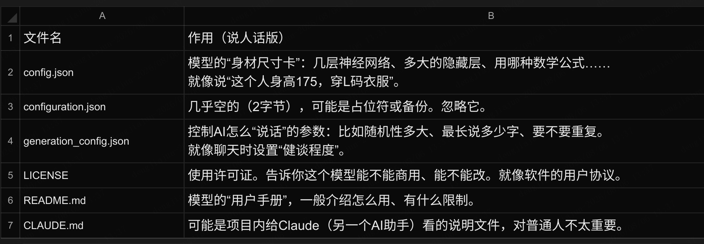

# 探秘AI大脑：一个语言模型的文件包里到底有什么？


# 前言
大模型下载地址：https://www.modelscope.cn/models

当你和ChatGPT、Claude这样的AI聊天时，它的大脑——也就是那个巨大的“模型文件”。—> 在电脑里长什么样？我们就用一个真实的模型文件夹为例，像拆开一个神奇的锦囊一样，看看里面那些文件都藏着什么秘密。
- `Qwen 2.5B 大模型` 文件结构参考图

## 模型介绍 
- [Deepseek Qwen 7B 大模型介绍](https://www.modelscope.cn/models/deepseek-ai/DeepSeek-R1-Distill-Qwen-7B/summary)
- [Qwen 2.5B 大模型介绍](https://www.modelscope.cn/models/Qwen/Qwen2.5-1.5B-Instruct)


# 1 先看“身份证”和“说明书”
大模型文件具体简单介绍

  

# 2 真正的大脑——“权重weights文件” safetensors 

> Safetensors is **a modern, open\-source file format developed by Hugging Face specifically for storing machine learning model weights \(tensors\)**


这几个是最大的文件，好家伙，每个接近4GB！

- `model-00001-of-00004.safetensors`

- `model-00002-of-00004.safetensors`

- `model-00003-of-00004.safetensors`

- `model-00004-of-00004.safetensors`

- `model.safetensors.index.json`（模型分片索引，告诉你哪个`params`在哪个分片`partitioning`里）

通俗解释：
AI的大脑由几十亿个“数字小旋钮”组成（专业叫`“参数” params`或`“权重”  weights`）。这些小旋钮的数值决定了AI会怎么回答你。因为旋钮太多（比如70亿个），存下来要十几GB，一个文件装不下，所以切成4块，像分卷压缩包一样。`.safetensors`是一种安全高效的格式，不会混入恶意代码。

 `tokenizer.json`

作用：以结构化 JSON 形式完整保存分词器的“词汇表”与“合并规则”（适用于 Byte\-Pair Encoding、WordPiece、Unigram 等算法）。

包含内容：

- 词表（vocab）：每个 token 及其对应的唯一 ID（例如 `"hello": 1234`）。

- 合并规则（merges）：BPE 等算法如何从字符逐步合并成子词的顺序。

- 类型和配置：如分词器类型（`"BPE"`、`"Unigram"`）、是否添加特殊 token（`<unk>`、`<s>`、`</s>` 等）、预分词规则（如按字母、数字、空格分割）。

- 添加的特殊 token 列表及其 ID。

为什么独立为 json 文件：
相比传统的 `vocab.json` \+ `merges.txt` 组合，`tokenizer.json` 将全部信息聚合在一起，加载更快，且支持更丰富的分词策略（例如 `tokenizers` 库的原生格式）。模型推理或微调时，直接加载此文件即可重建完整的分词器对象。

---

## 2.1 `tokenizer_config.json`

作用：存储分词器的`运行时配置参数`，控制其行为（如填充、截断、特殊 token 的对应字符串）。

常见字段：

- `"add_prefix_space"`：是否自动在句子开头添加空格（对某些模型如 GPT\-2 很重要）。

- `"padding_side"` / `"truncation_side"`：默认填充/截断方向（左或右）。

- `"model_max_length"`：模型支持的最大输入长度。

- `"eos_token"`、`"bos_token"`、`"unk_token"`、`"pad_token"`：特殊 token 的字符串表示（例如 `"<|endoftext|>"`）。

- `"tokenizer_class"`：指定分词器的类名（如 `"PreTrainedTokenizerFast"`、`"LlamaTokenizer"`），用于自动加载正确的实现类。

- `"chat_template"`：对话模板（如适用于 `apply_chat_template` 方法的 Jinja 模板）。

与 `tokenizer.json` 的区别：
`tokenizer.json` 定义“如何切词\+映射 ID”，而 `tokenizer_config.json` 定义“切词后如何处理序列（填充、截断、特殊 token 替换）以及加载哪个类”。两者配合使用才能完整复现训练时的分词行为。

---

## 2.2 模型加载使用示例（HuggingFace Transformers）

```Python
from transformers import AutoModelForCausalLM, AutoTokenizer

model_name = "Qwen/Qwen2.5-3B-Instruct"

model = AutoModelForCausalLM.from_pretrained(
    model_name,
    torch_dtype="auto",
    device_map="auto"
)
tokenizer = AutoTokenizer.from_pretrained(model_name)

prompt = "Give me a short introduction to large language model."
messages = [
    {"role": "system", "content": "You are Qwen, created by Alibaba Cloud. You are a helpful assistant."},
    {"role": "user", "content": prompt}
]
text = tokenizer.apply_chat_template(
    messages,
    tokenize=False,
    add_generation_prompt=True
)
model_inputs = tokenizer([text], return_tensors="pt").to(model.device)

generated_ids = model.generate(
    **model_inputs,
    max_new_tokens=512
)
generated_ids = [
    output_ids[len(input_ids):] for input_ids, output_ids in zip(model_inputs.input_ids, generated_ids)
]

response = tokenizer.batch_decode(generated_ids, skip_special_tokens=True)[0]
```


---

## 2.3 总结

- `tokenizer.json`：分词器的“硬数据”（词表、合并规则），决定文本如何被切分为 token。

- `tokenizer_config.json`：分词器的“软配置”（填充、截断、特殊 token 的字符串形式、聊天模板），用于控制分词器在预处理时的行为。

两个文件缺一不可，共同保证模型在推理或微调时与训练时的分词逻辑完全一致。


# 3 几个奇怪的小文件（可能是个人习惯或缓存）

- `mdl`：只有49字节，可能是某个脚本的链接或标记。

- `.msc`：1\.1KB，也许是一种模型缓存或Meta的某种格式。

- `.mv`：36字节，大概率是临时文件或移动命令的记录。

不用管它们——不是模型运行必需的，可能是模型下载或转换过程中留下的“小纸屑”。

# 五、总览：模型文件夹就像一顿晚餐

# 六、为什么你要知道这些？

- 如果你想下载并使用一个开源模型（比如Llama、Qwen、DeepSeek），看到这一堆文件别慌——只要保留
  `.safetensors`、`.json 配置`、`tokenizer`、`vocab.json`、`merges.txt`和`LICENSE`，其他可以删。

- 如果你想自己微调模型，就主要动那几个分片（但需要强大的显卡）。

- 如果你只是想聊个天，根本不用打开这个文件夹，用现成的API或者界面就好。

最后记住：这些文件加在一起，就是一个会思考、能对话的数字大脑。虽然它只是一堆二进制数字，但通过巧妙的数学运算，它就能像模像样地和你聊天、写诗、解数学题。


